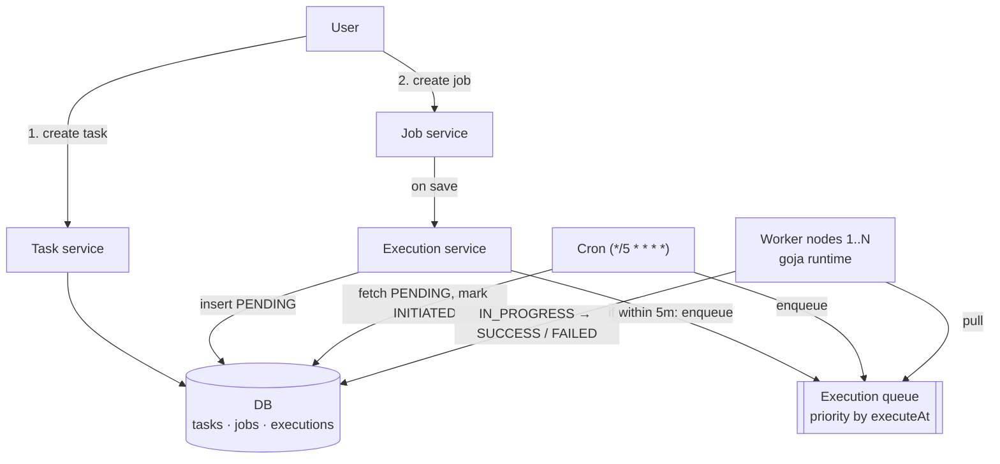
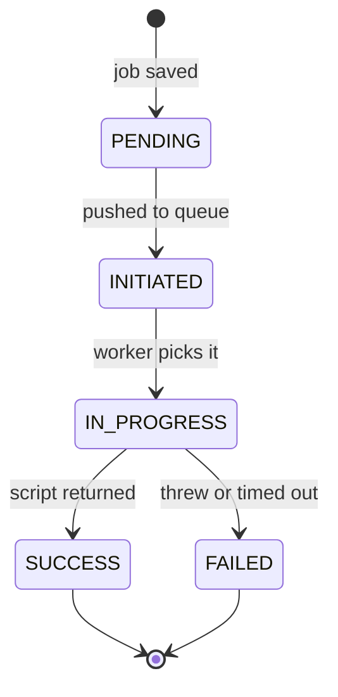
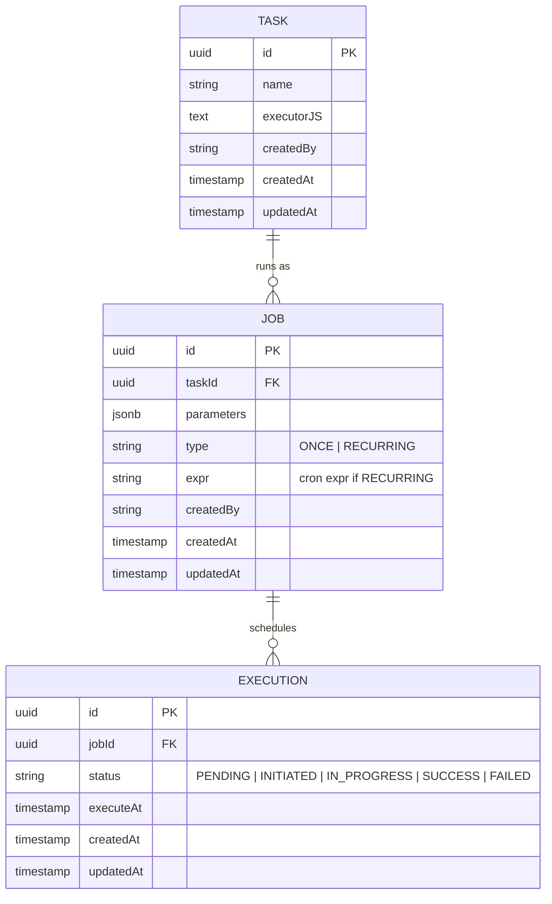

# Job scheduler

## Flow

1. The user creates a **task**: a JS function (`executorJS`) to run.
2. The user creates a **job** for that task with a schedule: `ONCE` or `RECURRING` (cron expression).
3. When the job is saved, the execution service inserts the next **execution** into the DB as `PENDING`. If it is due within `config.execDelay.duration` (5 min), it is also pushed to the execution queue and marked `INITIATED`.
4. A cron runs every 5 minutes, fetches `PENDING` executions due in the next 5 minutes, marks them `INITIATED` and enqueues them.
5. Worker nodes pull from the queue, run the script in a goja runtime, and write the status back to the DB.



## Execution status

No retries: a failed execution stays `FAILED`.



## Data model



## Config

```yaml
execDelay:
  duration: PT5M
```

## Open questions

- **Next run of a `RECURRING` job:** saving the job creates only the first execution. Whatever marks an execution `INITIATED` (cron or execution service) should also insert the next `PENDING` one from the cron expression. Waiting for `SUCCESS`/`FAILED` would stop the job forever if a worker crashes mid-run.
